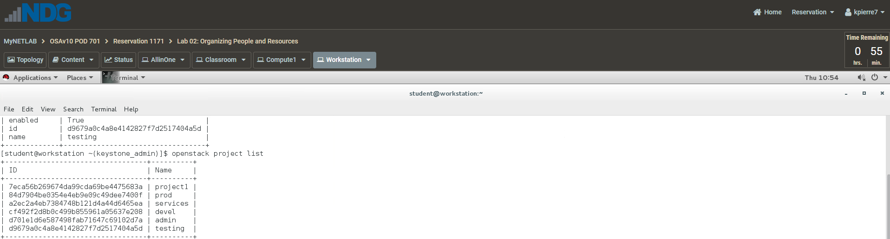

# Organizing People and Resources

Section 1, Step 8b - showing devel project in the Horizon Dashboard.

Section 2, Step 3 - showing the details of the newly created testing
project.

Section 2, Step 6 - showing that the testing project has been deleted.

Section 3, Step 6d - showing cloud-dev, cloud-test1, and cloud-test2
users in the Horizon Dashboard.

Section 3, Step 7 - showing that user cloud-test1 has been deleted.

Section 3, Step 8c - showing you can't login as cloud-test2. The error
will be invalid credentials.

Section 4, Step 2b - showing the details of the newly created
cloud-test3 user.

Section 4, Step 6b - showing you cannot list the flavors as cloud-test3
because the account is disabled.

Section 4, Step 10 - showing you can now list the flavors as
cloud-test3.

Section 4, Step 11c - showing that the user cloud-test3 has been
deleted.

Section 5, Step 7e - showing that the user cloud-admin has admin
privileges and is able to create other users.

Section 6, Step 3e - showing admin role for the user cloud-user2.

Section 6, Step 8 - showing cloud-user1 and cloud-user2 users have been
deleted.

Section 7, Step 14f - showing you cannot launch this instance because of
the RAM quota.

Section 8, Step 5d - showing the new quota values for the test1 project.

